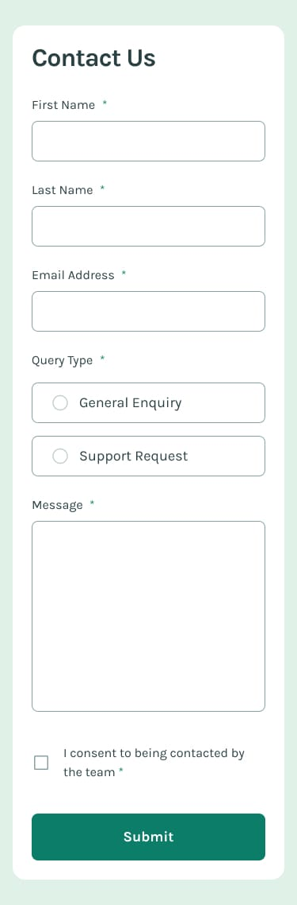

# 📬 Contact Form

This is a solution to the [Contact Form challenge on Frontend Mentor](https://www.frontendmentor.io/challenges/contact-form--G-hYlqKJj). This project focuses on implementing a contact form with form validation, and showing a success message upon successful submission.

---

## 📋 Table of Contents

- [Overview](#overview)
  - [Screenshots](#screenshots)
  - [Live Links](#live-links)
  - [Built With](#built-with)
- [Author](#author)

---

## Overview

Users should be able to:

- Complete the contact form and see a success message upon successful submission.
- Get form validation messages if:
  - A required field has been missed.
  - The email address is not formatted correctly.
- Use the form completely with the keyboard.
- View the contact form in an optimal layout depending on their device's screen size (responsive).
- See hover and focus states for all interactive elements on the page.

### Screenshots

#### 🖥️ Desktop View

#### 📱 Mobile View

---

### Live Links

- 📁 GitHub Repository: [Contact Form](https://github.com/vedantagrawal524/contact-form)
- 🌐 Live Site: [https://contact-form524.vercel.app/](https://contact-form524.vercel.app/)

---

### Built With

- HTML5
- CSS3
- Flexbox
- JavaScript
- Media Queries
- [Vercel](https://vercel.com/) for deployment

---

## Author

- Portfolio – _Vedant Agrawal_
- Frontend Mentor – [@vedantagrawal524](https://www.frontendmentor.io/profile/vedantagrawal524)
- GitHub – [@vedantagrawal524](https://github.com/vedantagrawal524)

---

📌 _If you like this project, feel free to fork it, star it ⭐, or suggest improvements. Happy Coding!_
